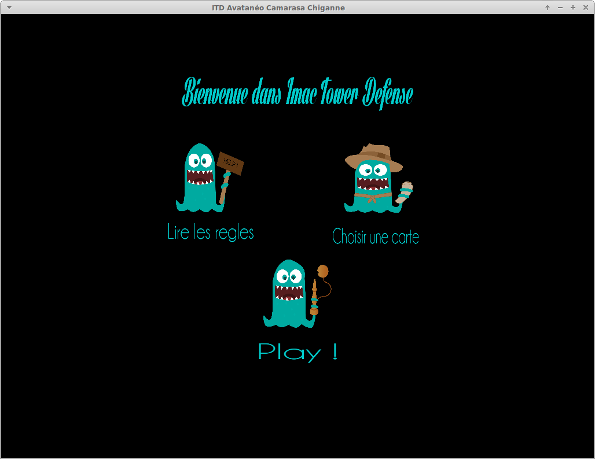
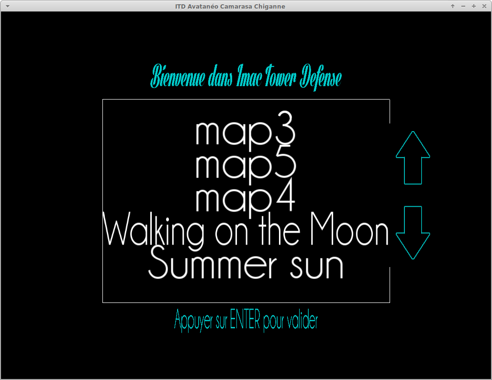
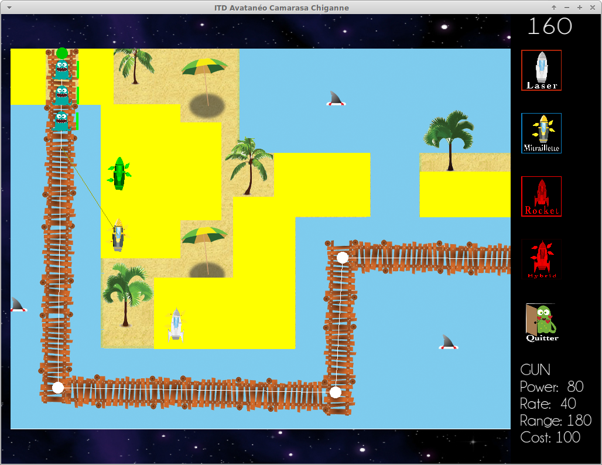

Imac Tower Defense
===

 
ITD is a project developped in 2 months for a computer graphics course at the IMAC (Image Multimedia Audiovisual Communication) engineering school.
It's a 2D tower defense developped with OpenGL 2 (and SDL for window and events management).
The Game Engine is modular and easily extendable but the graphic engine should be reviewed.
